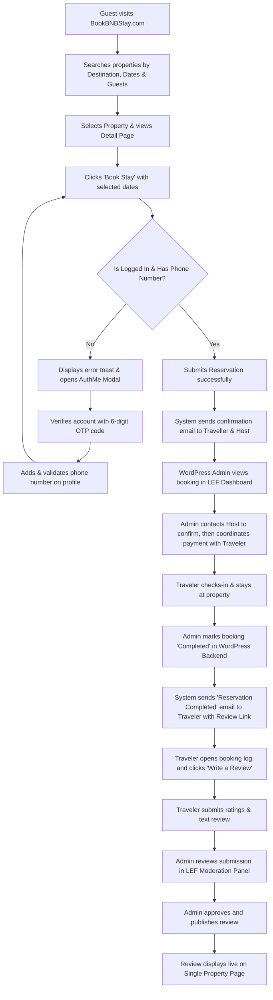

# Project Showcase: BookBNBStay
**Domain:** [http://bookbnbstay.com/](http://bookbnbstay.com/)  
**Platform:** Custom Vacation Rental & Property Booking Management System  

---

## 1. Executive Summary

**BookBNBStay** is a custom-engineered, high-performance vacation rental and property booking platform built for WordPress. Unlike standard booking solutions that depend on heavy, generic custom post type setups or bloated e-commerce plugins (such as WooCommerce), BookBNBStay is driven by a custom-designed database schema. Operating directly on optimized MySQL tables via WordPress's `$wpdb` engine ensures sub-second database query execution, clean structural mapping, and robust site performance under heavy user loads.

The architecture is split into **four decoupled custom WordPress plugins** working in tandem:
1. **AuthMe (`auth-vr`)** - Handles popups, registration/login, OTP email codes, Google OAuth, and Host applications.
2. **Admin Management (`admin-manager-vr`)** - Governs central page routing mappings and database table checks.
3. **Listing Engine Backend (`leb-vr`)** - Manages property listings, locations, and amenities directory CRUDs.
4. **Listing Engine Frontend (`lef-vr`)** - Controls property search, filters, booking checkout, reviews, traveler/host dashboards, and payouts.

---

## 2. Multi-Plugin Architecture & Repositories

### 🔗 Plugin Repositories
* **AuthMe:** [https://github.com/ART-TECH-FUZION-PROJECTS/auth-vr](https://github.com/ART-TECH-FUZION-PROJECTS/auth-vr)
* **Admin Management:** [https://github.com/ART-TECH-FUZION-PROJECTS/admin-manager-vr](https://github.com/ART-TECH-FUZION-PROJECTS/admin-manager-vr)
* **Listing Engine Backend:** [https://github.com/ART-TECH-FUZION-PROJECTS/leb-vr](https://github.com/ART-TECH-FUZION-PROJECTS/leb-vr)
* **Listing Engine Frontend:** [https://github.com/ART-TECH-FUZION-PROJECTS/lef-vr](https://github.com/ART-TECH-FUZION-PROJECTS/lef-vr)

---

### 🔑 1. AuthMe (`auth-vr`)
Manages security, custom user roles, OTP passwordless verification, and multi-step host onboardings.
* **Core Features:**
  * **Overlay Auth Modals:** Intercepts default WordPress redirect pathways to show beautiful login, registration, and reset screens.
  * **OTP Verification System:** Sends a 6-digit pin via custom HTML emails to verify new accounts or password resets, including a 60-second resend cooldown timer.
  * **Google OAuth Validation:** Google Identity Services SDK connection allowing users to register or log in instantly, automatically alerting users via email on new logins.
  * **Host Onboarding Pipeline:** A multi-step form capturing personal profiles, ID credentials (Aadhar & PAN), and handling document image uploads restricted to JPEG/JPG/PNG under 1MB.
  * **Custom Roles:** Defines `Traveller` (default) and `Host` roles.
* **Database Tables:**
  * `wp_authme_otp_storage`: Tracks temporary user data payloads, active 6-digit OTP codes, verification status, and expiration.
  * `wp_host_request`: Stores Host application forms, document upload paths, and review status (`pending`, `approved`, `rejected`).

---

### ⚙️ 2. Admin Management (`admin-manager-vr`)
Acts as the central configuration directory and page router mapping system.
* **Core Features:**
  * **Dynamic Page Mapper:** Maps virtual endpoints (e.g. Profile Page, Search Archive, Wishlist) to actual WordPress Page IDs, allowing administrators to modify page titles or slugs without breaking core links.
  * **Database Status Monitor:** A diagnostic backend control panel displaying size checks, row counts, and table health for all core plugins.
  * **Auto-Pruning Engine:** Automatically removes unused option parameters and orphaned settings from the database.
  * **Global Toast Alert System:** Enqueues non-blocking custom JS notifications (Success, Error, Warning) globally across all plugins.
* **Database Tables:**
  * `wp_admin_management`: Stores settings parameters (name, page_id, config values).

---

### 🗄️ 3. Listing Engine Backend (`leb-vr`)
Controls the database directory and CRUD processes for property listings, destinations, and amenities.
* **Core Features:**
  * **Property CRUD Panel:** WordPress admin dashboard to define property information (title, capacity, price, coordinates, description, and specs).
  * **Amenity Manager:** Allows creating custom amenities (e.g., Wifi, Pool, Parking) with dedicated custom icon uploads.
  * **SVG Asset Validator:** Ensures uploaded icons are SVG format, under 1MB, and exactly 24x24px to guarantee clean layouts.
  * **Blocked Dates Selector:** A custom calendar interface allowing hosts and admins to select and block availability dates to prevent overbooking.
  * **Property Duplicator:** Multi-cloning tool that copies property records, amenities, blocked dates, and image arrays, resetting the status to `draft` for quick catalog scaling.
* **Database Tables:**
  * `wp_ls_types`: Properties type index (e.g., Apartments, Villa, Cabin, Studio).
  * `wp_ls_amenities`: Custom amenities directory with media library icon attachments.
  * `wp_ls_location`: Target destinations with custom SVG icons.
  * `wp_ls_property`: Core listing variables (title, host, coordinates, capacity, pricing, room count).
  * `wp_ls_img`: Gallery image references stored as JSON arrays per listing.
  * `wp_ls_block_date`: Date range listings blocked for bookings.

---

### 💻 4. Listing Engine Frontend (`lef-vr`)
Powers the guest search interfaces, property catalogs, booking checkout flow, dashboards, and review systems.
* **Core Features:**
  * **Frontend Shortcodes:** Custom UI integrations (`[premium_search_bar]`, `[listing_engine_view]`, `[single_property_view]`, `[lef_my_profile]`).
  * **Availability Filters:** Filters listings by check-in/out ranges, guest count capacity, destinations, price ranges, and amenity tags.
  * **Booking Processor:** Form validation checks for guest authentication and verified phone numbers before submitting a booking.
  * **Traveler Dashboard:** Active and past booking logs, edit profile, and saved wishlists.
  * **Host Dashboard:** Listings manager, calendar blocked dates, and payout options (Bank Account details or UPI ID).
  * **Reviews Moderation Console:** Multi-metric rating forms (Location, Cleanliness, Comfort, etc.) submitted by guests, held in a review moderation queue before publishing.
* **Database Tables:**
  * `wp_ls_reservation`: Contains traveler details, booking totals, dates, and reservation status (`pending`, `completed`, `cancelled`).
  * `wp_ls_reviews`: Holds user ratings, feedback strings, and approval status (`pending`, `approved`).
  * `wp_ls_wishlist`: Connects traveler IDs to favorited property IDs.

---

## 3. End-to-End User Reservation & Review Workflow

The website follows a structured and automated booking lifecycle:
1. **Search & Discovery:** A traveler visits the homepage or properties catalog page, searching by destination, check-in/check-out dates, and guest capacity.
2. **Property Details & Selection:** The guest selects a listing and clicks the "Reserve Now" button on the booking card.
3. **Authentication & Profile Check:** The booking validator checks if the user is logged in and has added a mobile number to their profile.
   * If **No:** The system displays an error toast notification and opens the **AuthMe Modal Overlay**. The user registers or logs in (verifying their identity with a 6-digit OTP email code) and validates their mobile number on their dashboard.
   * If **Yes:** The reservation is submitted successfully.
4. **Email Notification Alerts:** The guest and the host automatically receive an HTML confirmation email detailing the booking specifics, pricing details, and reservation number.
5. **Admin Review & Coordination:** The WordPress administration team is alerted to the new reservation. The team contacts the host to verify property availability, coordinates the payment process with the traveler, and finalizes the stay.
6. **Traveler Stay:** The guest checks-in and completes their stay at the property.
7. **Marking Stay Completed:** In the backend, the administrator manually changes the reservation status to **Completed**.
8. **Automated Feedback Request:** The status update triggers an automated email to the traveler, informing them their stay is completed and providing a direct link to review the property.
9. **Submitting a Review:** The traveler opens their profile booking log, clicks the "Write a Review" button, rates the property metrics, and submits a feedback description.
10. **Moderation & Publication:** The review is held in a "Pending" moderation queue in the admin dashboard. The administrator reviews and approves the submission, making it live on the property details page.

---

## 4. Screenshots

---

## 5. Security & Development Policies

The plugins are written with strict adherence to WordPress development rules:
1. **Strict Input Sanitization & Escaping:** All database writes utilize `$wpdb->prepare()`. HTML outputs use `esc_html()`, `esc_attr()`, and `wp_kses_post()`.
2. **Access Control Checkpoints:** All administrative AJAX hooks verify unique nonces (`wp_verify_nonce`) and confirm high-level credentials (`current_user_can('manage_options')`).
3. **Decoupled Styling Architectures:** Pure custom CSS and JS assets are loaded conditionally based on screen IDs, using `filemtime()` version controls to bypass browser-caching issues during updates.
4. **Structured Assets Directories:** Features separate `/assets/frontend/`, `/assets/backend/`, `/templates/frontend/`, and `/templates/backend/` folders to enforce a clean separation of concerns.